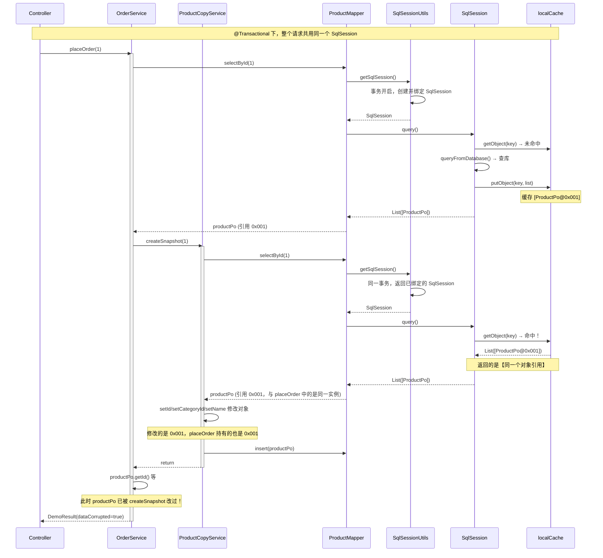
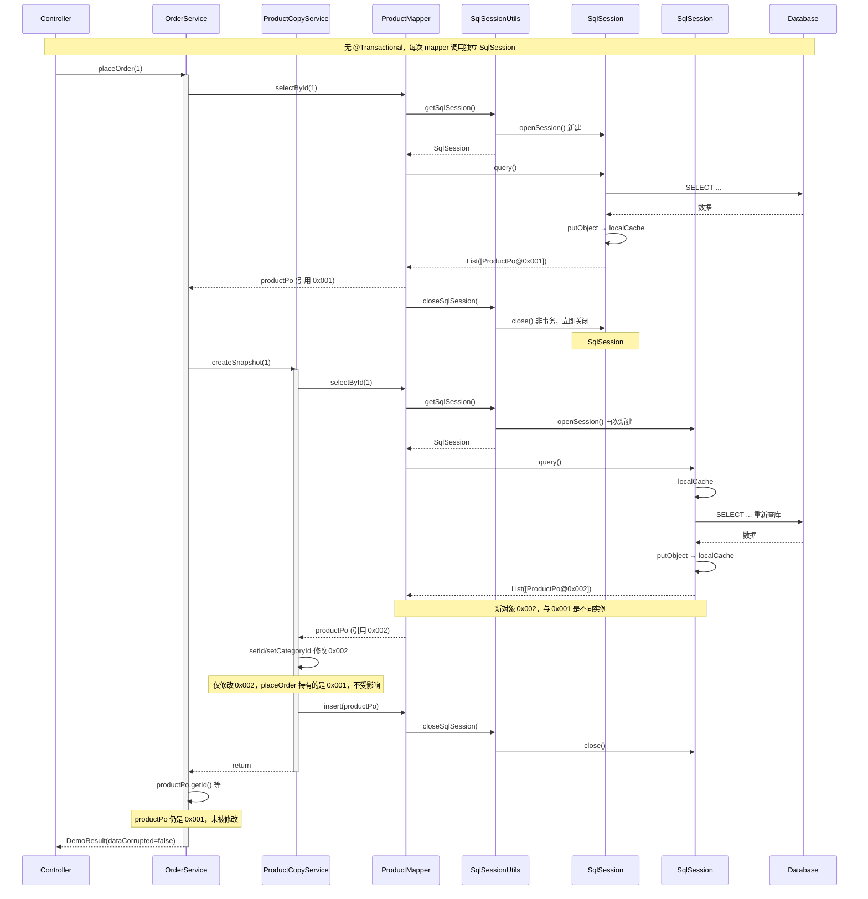
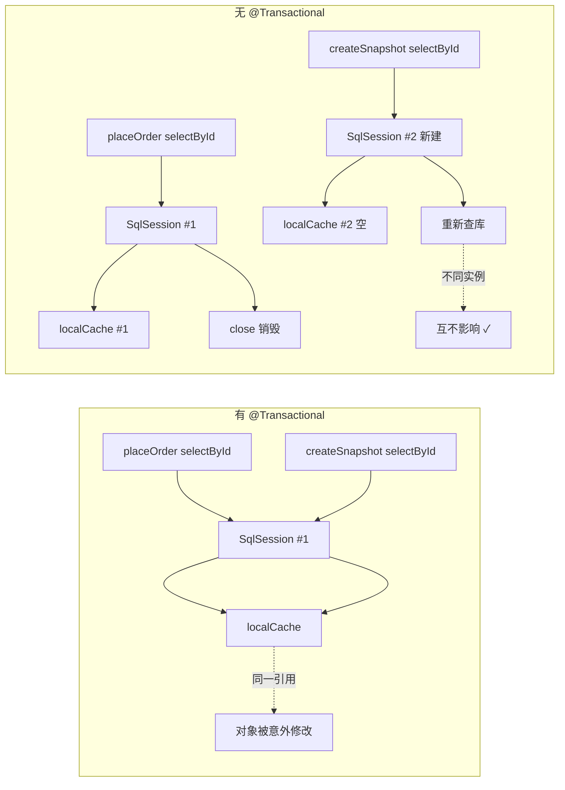

# MyBatis 一级缓存导致对象意外修改 - Demo

## 问题说明

在同一 `@Transactional` 事务内：

1. **OrderService.placeOrder()** 先 `selectById(productId)` 得到 `productPo`
2. 接着调用 **ProductCopyService.createSnapshot(productId)**
3. **createSnapshot** 内部再次 `selectById(productId)`，由于 MyBatis **一级缓存**（同一 SqlSession），返回的是 **同一个对象实例**
4. **createSnapshot** 对该对象做 `setId()`、`setCategoryId()` 等修改
5. 回到 **placeOrder()** 时，其持有的 `productPo` 实际上已被修改，导致后续使用出错

## 运行方式

```bash
mvn spring-boot:run
```

然后访问（首次启动约需 15–20 秒）：

```
http://localhost:8080/demo/place-order?productId=1
```

## 实际运行结果

返回的 JSON 类似：

```json
{
  "idBeforeCall": 1,
  "categoryIdBeforeCall": 100,
  "nameBeforeCall": "iPhone 15",
  "idAfterCall": 10001,
  "categoryIdAfterCall": 888,
  "nameAfterCall": "快照副本",
  "dataCorrupted": true
}
```

（`idAfterCall` 每次递增，因为每次都会 insert 新记录）

- **idBeforeCall / idAfterCall**：调用 createSnapshot 前后，placeOrder 持有的 `productPo.getId()` 发生变化
- **dataCorrupted: true**：说明对象被意外修改

这证明：`placeOrder()` 中的 `productPo` 与 `createSnapshot()` 中查询到的是 **同一个对象引用**，对后者的修改直接影响前者。

## 修复思路

在 `createSnapshot` 中：查询出对象后，先用 `BeanUtils.copyProperties` 复制一份，再对副本做修改并 insert，避免修改 MyBatis 缓存的实例。

---

## 源码层面的深层解析

### 一、一级缓存的本质：直接返回缓存中的对象引用

MyBatis 一级缓存的实现核心在 `BaseExecutor` 和 `PerpetualCache`：

**1. PerpetualCache 只是 HashMap 的简单包装**

```java
// org.apache.ibatis.cache.impl.PerpetualCache
private final Map<Object, Object> cache = new HashMap<>();

public Object getObject(Object key) {
    return cache.get(key);  // 直接返回 Map 中存储的引用，不做任何拷贝！
}
```

**2. BaseExecutor 查询时的缓存逻辑**

```java
// org.apache.ibatis.executor.BaseExecutor#query
list = resultHandler == null ? (List<E>) localCache.getObject(key) : null;
if (list != null) {
    handleLocallyCachedOutputParameters(ms, key, parameter, boundSql);
} else {
    list = queryFromDatabase(ms, parameter, rowBounds, resultHandler, key, boundSql);
}
return list;  // 命中缓存时，返回的就是 localCache 中存的【同一个 List】
              // List 里的实体对象，与第一次查询时创建的是【同一引用】
```

`queryFromDatabase` 会把查询结果原样放入缓存：

```java
localCache.putObject(key, list);  // 存储的是 ResultHandler 组装出的 List
return list;                      // 返回的也是同一个 list 引用
```

因此，**一级缓存的语义是「复用同一对象」**，而不是「返回一份拷贝」。两次相同查询得到的是同一个 List、同一个实体实例。

---

### 二、事务与 SqlSession 复用：问题的触发条件

MyBatis-Spring 通过 `SqlSessionUtils.getSqlSession()` 决定是否复用 SqlSession：

```java
// org.mybatis.spring.SqlSessionUtils
var holder = (SqlSessionHolder) TransactionSynchronizationManager.getResource(sessionFactory);
var session = sessionHolder(executorType, holder);
if (session != null) {
    return session;   // 有事务且已有绑定 → 直接返回同一 SqlSession
}
// 否则创建新的
session = sessionFactory.openSession(executorType);
registerSessionHolder(...);  // 如有事务则绑定到 TransactionSynchronizationManager
return session;
```

**关键点：**

| 场景 | SqlSession 行为 |
|------|----------------|
| **有 `@Transactional`** | 事务开启时创建 SqlSession 并绑定到 `TransactionSynchronizationManager`，整个事务内复用同一个 SqlSession → **共享同一个 localCache** |
| **无事务** | 每次 mapper 调用都会新建 SqlSession，用完后 `closeSqlSession` 会立即关闭（"Closing non transactional SqlSession"），下次调用再新建 → **每次都是新的 localCache** |

```java
// closeSqlSession 逻辑
if (holder != null && holder.getSqlSession() == session) {
    holder.released();  // 事务内：不关闭，等事务结束再关
} else {
    session.close();   // 非事务：立即关闭，localCache 随之销毁
}
```

---

### 三、为什么有事务就会出现「对象被意外修改」？

调用链：

1. `placeOrder()` 带 `@Transactional` → Spring 开启事务  
2. `productMapper.selectById(1)` → 从 `TransactionSynchronizationManager` 取出/创建 SqlSession A，查库，结果放入 `SqlSession A.localCache`  
3. 返回的 `productPo` 即缓存中 List 里的元素，是**同一引用**  
4. 调用 `productCopyService.createSnapshot(1)`，仍在同一事务中  
5. `productMapper.selectById(1)` → 再次从 `TransactionSynchronizationManager` 拿到 **同一个 SqlSession A**  
6. `localCache.getObject(key)` 命中 → 返回**同一个 List、同一个 ProductPo 实例**  
7. `createSnapshot` 对该实例做 `setId`、`setCategoryId` 等修改  
8. 回到 `placeOrder()`，它持有的 `productPo` 与 `createSnapshot` 改的是同一对象 → 出现「意外修改」

**时序图（有事务）：**



**流程图（对象引用关系）：**

```mermaid
flowchart TB
    subgraph 有事务
        A[placeOrder 调用 selectById] --> B[SqlSession #1 查库]
        B --> C[结果放入 localCache]
        C --> D[返回 productPo 引用 0x001]
        D --> E[调用 createSnapshot]
        E --> F[createSnapshot 调用 selectById]
        F --> G[复用同一 SqlSession #1]
        G --> H[localCache 命中]
        H --> I[返回同一 productPo 引用 0x001]
        I --> J[createSnapshot 修改对象]
        J --> K[placeOrder 持有的 productPo 也被修改]
    end

    style K fill:#ffcccc
```



---

### 四、不在事务里会不会有这个问题？—— 不会

**无事务时的流程：**

1. `placeOrder()` 无事务 → `productMapper.selectById(1)` 使用新建 SqlSession #1，查库，结果放入 #1 的 localCache，调用结束后 **`closeSqlSession` 立刻关闭 #1**  
2. `createSnapshot(1)` → `productMapper.selectById(1)` 使用新建 SqlSession #2，**#2 的 localCache 为空**，会重新查库  
3. 返回的是**新查出来的、另一份对象**  
4. 对这份对象做修改，不会影响之前 `placeOrder` 里的那一份  

因此：**不在事务中，每次 mapper 调用会使用不同的 SqlSession，从而不会共享一级缓存，也就不会出现「先查后改、误改原对象」的问题**。

**时序图（无事务）：**



**流程图（有事务 vs 无事务对比）：**



---

### 五、总结

| 维度 | 说明 |
|------|------|
| **根因** | 一级缓存在同一 SqlSession 内直接返回缓存中的对象引用，不做拷贝；事务内 SqlSession 被复用，导致多次调用共享同一缓存对象 |
| **为何违背直觉** | 通常以为「查询」是只读的，不会改变已有对象；但这里拿到的是缓存的引用，对它的修改会反映到所有持有该引用的地方 |
| **是否与事务强相关** | 是。无事务时每次新建并关闭 SqlSession，缓存不会跨调用共享，问题不会出现 |
| **缓解/修复** | 对需要修改的实体做深拷贝再改；或将 `localCacheScope` 设为 `STATEMENT`，使每次执行后清空一级缓存 |
